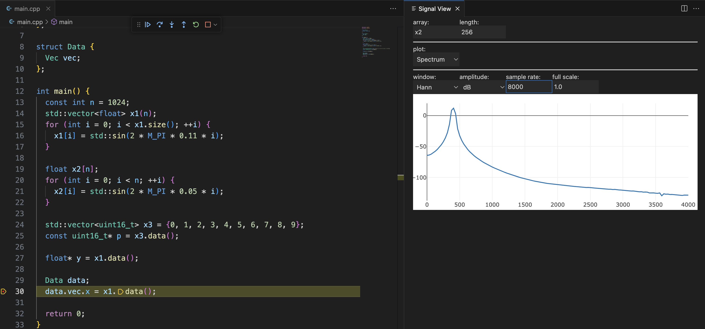

## Signal View

Visual Studio Code extension for viewing signals in debug mode

### Features

- Time domain plot;
- Spectrum plot;
- Update for each step of the debugger;
- Access to nested objects (example obj1._data._array);
- Read and view memory by pointer (experimental for `C/C++`);
- Works via `vscode.DebugSession` (those. most languages ​​should be supported);

### Commands

`SigView: Create view panel` to create panel with plot on current debug session.

